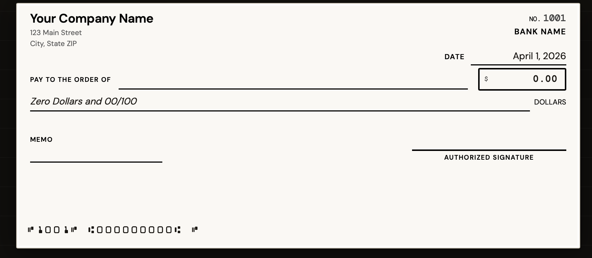
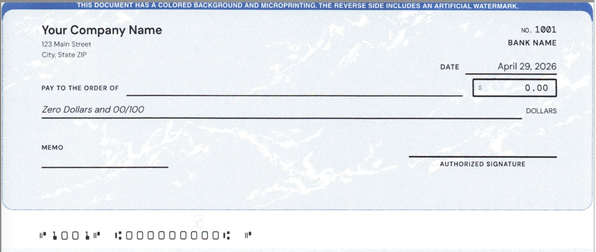

# Check Printer — Bank Check Print Tool

**[Try it → jasonroland.github.io/check-printer](https://jasonroland.github.io/check-printer/)**

Print checks from your browser. Fill in your info, preview, and print onto blank check stock at 100% scale. Formatted for standard business checks (3.5" tall).



No backend. Nothing sent anywhere.

## Real printed check

Used this to print real checks — they deposited without any issues.



**Tested with:** [EnDoc Diamond Blue check stock](https://www.amazon.com/Endocs-Computer-Check-Paper-Compatible/dp/B084BXRVZT/)

## Run it locally

```bash
git clone https://github.com/jasonroland/check-printer.git
cd check-printer
open index.html
```

No install or build step needed — it's a static HTML file.

---

MIT — Built by [Chill Labs](https://chilllabs.vercel.app)
